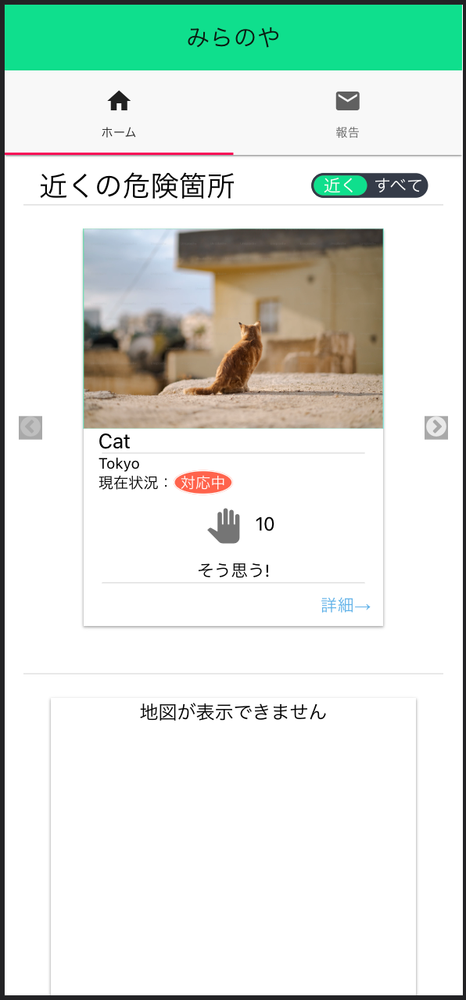
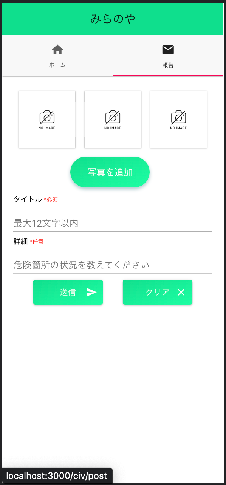

# 概要
近くの危険箇所を報告するプラットフォーム。
本リポジトリは市民側のアプリケーションである。
Civictech Challenge Cup 2021提出作品。

- URL: https://miranoya.github.io/ccc-mobile/
- QRCode:

    

# 機能一覧
- 市民側
    - 行政に地域の危険や小さな要望を文字と写真で報告できる
    - 報告一覧で近くの危険をアプリ上で確認できる
    - 報告された要望に対して賛同の意を示す「そう思う」ボタンを実装

    
    

- 行政側(現在は未稼働)
    - パソコンのブラウザで使用することを想定。
    - 市民から報告された危険や要望を一覧として表示
    - 報告された位置を地図上で表示

# 特徴
- 市民側
    - 基本的にスマートフォンで使用することを想定
    - 近くの危険や要望を確認できるようにし、周知できるようにした
    - 賛成ボタンによってどれだけのユーザーが改善してほしいと思っているかを可視化できるようにした

# アクセシビリティ
- 設計の段階で市民側が「気軽に」報告できるようにネイティブアプリだけでなく、Webベースで開発し、インストールの手間を削減した。更に市民側ではログイン機能をなくし、報告フォームまでたどり着くまでの手数を最小限に抑えた。
- 種画面を「ホーム」と「報告フォーム」の2つのみとし、タブバーを直感的に操作できるようにした。主機能以外の機能を最小限とし、全体的にシンプルなUIでユーザーが操作を迷わないようにした。

# 開発環境
- React 17.0.2
- Node.js 16.5.0
- npm 7.19.1

# 動作環境
- スマートフォン(iOS,Android)
- ブラウザ(Google Chrome, Firefox, Safari)

# 動作状況

- 現在はサーバーと行政側フロントエンドは未稼働
- 市民側フロントエンドはモックデータでデモ稼働中
- 以下の機能は現在使えない
    - 危険箇所投稿機能
    - 地図表示

